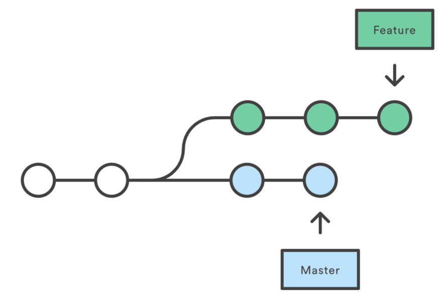

[< К содержанию](./Readme.md)

# GIT branch

1. ### Создание новой ветки. 

Основная ветка в каждом репозитории называется master. Чтобы создать еще одну ветку, используем команду branch (name).

Пример: `git branch new_experimental`

Это создаст новую ветку, пока что точную копию ветки master.

2. ### Переключение между ветками.

Сейчас, если мы запустим branch, мы увидим две доступные опции:

   * new_experimental
   * *master

master — это активная ветка, она помечена звездочкой. Но мы хотим работать с нашей “новой экспериментальной веткой”, так что нам понадобится переключиться на другую ветку. Для этого воспользуемся командой checkout, она принимает один параметр — имя ветки, на которую необходимо переключиться. 

Выглядит это так: `git checkout new_experimental`

В Git ветка — это отдельная линия разработки. Git checkout позволяет нам переключаться как между удаленными, так и меду локальными ветками. Это один из способов получить доступ к работе коллеги или соавтора, обеспечивающий более высокую продуктивность совместной работы.

3. ### Слияние веток.

Наша "новая экспериментальная ветка" будет еще одним текстовым файлом под названием experimental.txt. Мы создадим его, добавим и закоммитим:

`git add experimental.txt`

`git commit -m "new_experimental complete."`

Изменения завершены, теперь мы можем переключиться обратно на ветку master:

`git checkout master`

Теперь, если мы откроем наш проект в файловом менеджере, мы не увидим файла feature.txt, потому что мы переключились обратно на ветку master, в которой такого файла не существует. Чтобы он появился, нужно воспользоваться merge для объединения веток (применения изменений из ветки `new_experimental` к основной версии проекта):

`git merge new_experimental`

Теперь ветка master актуальна. Ветка amazing_new_feature больше не нужна, и ее можно удалить:

`git branch -d new_experimental`

Если хотите создать копию удаленного репозитория - используйте git clone. 

