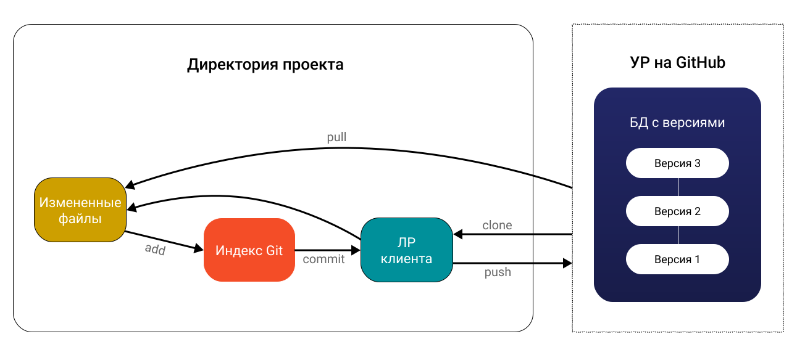

[< К содержанию](./Readme.md)

# GIT pull

Если вы сделали изменения в вашем удаленном репозитории, другие пользователи могут скачать изменения при помощи команды `pull`.

Пример: 

`git pull origin master`